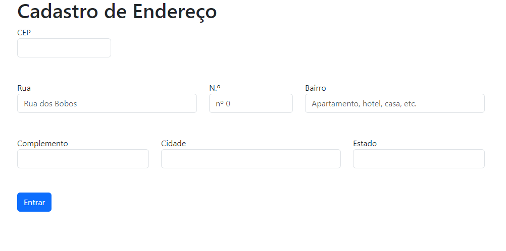

# ìndice
[Introdução](#introdu%C3%A7%C3%A3o)  
[Descrição de Funcionalidades 🛠️](#descri%C3%A7%C3%A3o-de-funcionalidades-%EF%B8%8F)  
[Tecnologias 🛠️](#tecnologias)  
[Fontes Consultadas](#fontes-consultadas)  
[Autor](#autor)  

# form-CadEndereço

O formulário de endereço serve para realizar o cadastro e, quando inserido o CEP, campos como "rua", "bairro", "cidade" e "estado" são preenchidos automaticamente.

# Introdução
Projeto criado inicialmente com função de explicação da página usando Arrow Function para os alunos, ou seja, função de ensinar os alunos o uso de tal. Os campos preenchidos automaticamente, são graças ao Arrow Function.

# Descrição de Funcionalidades 🛠️:
Sistema para:
* Cadastrar Endereço a partir do formulário.

Melhor descrição: Formulário para fazer um cadastro a partir de um certo endereço, contendo informções de: Rua, CEP, N.º, Bairro, Complemento, Cidade e estado.
Com base no CEP escrito, o formuário automáticamente encontra o nome do bairro e da rua, facilitando a escrita de ambos. 

* fetch - Serve para acessar e manipular os pedidos e respostas da API, no código, o fetch é como se fosse uma "promessa", ou seja, vai acontecer
* await - Await é um elemento utilizado para esperar por uma "promessa"
* async() - Método que faz uma verificação assíncrona, ou seja, determina que a função é do tipo assíncrona e não precisa ser executada exatamente no momento
* /^[0-9]+$/.test(numero) - Essa expressão regular serve para verificar se o CEP inserido tem apenas números, mesmo eles sendo repetidos
* hasOwnProperty - Método de Object instâncias retorna um booleano indicando se este objeto possui a propriedade especificada como propriedade própria (em vez de herdá-la). ° Booleano - é um tipo de dado que representa apenas dois estados, verdadeiro ou falso.
### fetch, await e async tem uma ligação no código.

    const limparFormulario = () =>{
    document.getElementById('rua').value = '';
    document.getElementById('bairro').value = '';
    document.getElementById('cidade').value = '';
    document.getElementById('estado').value = '';
}

Essa função faz com que sempre que for cadastrar um novo endereço, o formulário apaga campos do endereço antigo.

    const preencherForumulario = (endereco) =>{
    document.getElementById('rua').value = endereco.logradouro;
    document.getElementById('bairro').value = endereco.bairro;
    document.getElementById('cidade').value = endereco.localidade;
    document.getElementById('estado').value = endereco.uf;
}

O código faz com que o formulário seja preenchido automaticamente, ao escrever CEP.

    const eNumero = (numero) => /^[0-9]+$/.test(numero);
const cepValido = (cep) => cep.length == 8 && eNumero(cep);
'use strict';

Checar se o tamanho do CEP está correto e se é apenas em números.

    const pesquisarCep = async() => {
    limparFormulario();
    const url = `https://viacep.com.br/ws/${cep.value}/json/`;
    
    if(cepValido(cep.value)){
        const dados = await fetch(url);
        const addres = await dados.json();
        
        
        if(addres.hasOwnProperty('erro')){ 
            // document.getElementById('rua').value = 'CEP não encontrado!';
            alert('CEP não encontrado!');
        }else {
            preencherForumulario(addres);
        }
    }else{
        // document.getElementById('rua').value = 'CEP incorreto!';
        alert('CEP incorreto!');
    } 
}

A função "async()" faz com que não precise ser seguida uma ordem exata e, como escrito nos comentários, é uma função para o consumo de API da Via CEO. O código vai "checar" com a Via CEP se o CEP inserido é válido, caso o CEP não seja, o site retornará uma mensagem de "CEP não encontado" senão, os campos de endereço são preenchidos automaticamente.

# Tecnologias 🛠️:
* ``JavaScript``
* ``CSS 3``
* ``HTML 5``
* ``GITHUB``
* ``GIT``
* ``Regex Pal``
* ``Bootstrap 5.0``
* ``API Via CEP``

# Fontes consultadas

* [Regex Pal - Testando funções](https://www.regexpal.com/)
* [Alura -  Como escrever um README](https://www.alura.com.br/artigos/escrever-bom-readme)
* [Via CEP - Consulte CEP](https://viacep.com.br/)
* [ALura - Await e Async no JavaScript](https://www.alura.com.br/artigos/async-await-no-javascript-o-que-e-e-quando-usar)
* [Mozilla - Await](https://developer.mozilla.org/pt-BR/docs/Web/JavaScript/Reference/Operators/await)
* [Mozilla - Fetch](https://developer.mozilla.org/pt-BR/docs/Web/API/Fetch_API/Using_Fetch)

# Autor
## projeto por- [@Layla Beatrice](https://www.github.com/laylabtrice) 